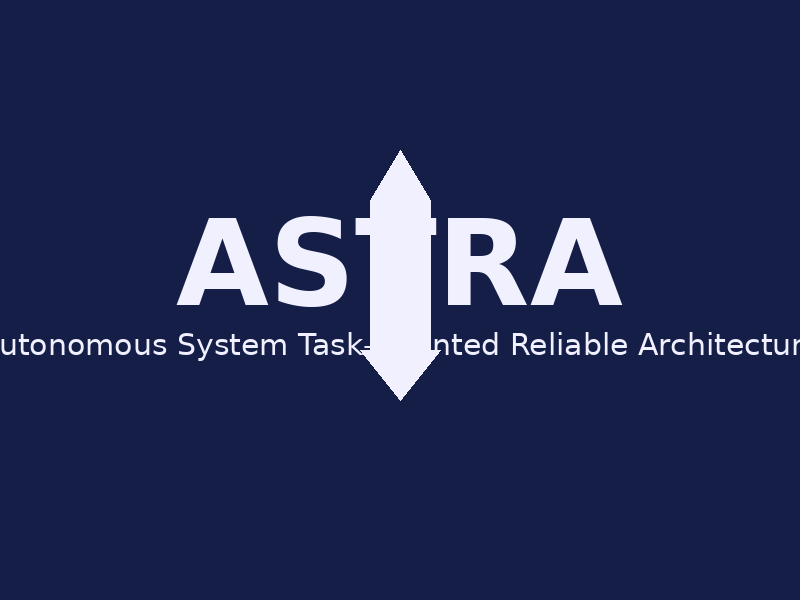

<p align="center">
  
</p>

# 🚀 ASTRA Programming Language

<div align="center">
  
  <br><br>
  
  [](https://github.com/infernasel/Astra/actions)
  [](https://github.com/infernasel/Astra/actions)
  [](https://github.com/infernasel/Astra/releases)
  [](https://github.com/infernasel/Astra/blob/main/CUSTOM_LICENSE.md)
  
  [](https://github.com/infernasel/Astra/releases)
  [](https://github.com/infernasel/Astra/wiki)
  [](https://github.com/infernasel/Astra/blob/main/CONTRIBUTING.md)
  
  [](https://github.com/infernasel/Astra/stargazers)
  [](https://github.com/infernasel/Astra/network/members)
  [](https://github.com/infernasel/Astra/issues)
  
  [](https://github.com/infernasel/Astra)
  [](https://github.com/infernasel/Astra)
  [](https://github.com/infernasel/Astra)
  
  [](https://github.com/infernasel/Astra/commits/master)
  [](https://github.com/infernasel/Astra/issues)
  [](https://github.com/infernasel/Astra/graphs/contributors)
</div>

ASTRA (Autonomous System Task-oriented Reliable Architecture) is a specialized programming language designed for controlling spacecraft and unmanned aerial vehicles (UAVs). This project aims to create a high-efficiency, safety-focused language for developing software used in spacecraft control, satellite systems, interorbital transfers, and autonomous drone flights.

## Project Overview

The ASTRA language is designed with the following key features:

- **Easy to learn and understand** for space engineers
- **High-speed compilation** with minimal memory usage
- **Efficient support** for multi-threaded data processing and asynchronous computing
- **Strong modular approach** to development
- **Type safety** and protection against accidental variable changes
- **Specialized capabilities** for space and aviation:
  - Fast vector operations and spatial coordinates
  - Special operations for trajectory calculations and course corrections
  - Rapid response mechanisms for external events
  - Simple ways to describe space and atmospheric condition models
  - Built-in procedures for simulating objects in space and atmosphere

## Project Structure

- `/compiler` - ASTRA language compiler implementation
- `/interpreter` - ASTRA language interpreter
- `/docs` - Language specification and documentation
- `/examples` - Example ASTRA programs
- `/tools` - Development tools and utilities
- `/hardware` - Hardware abstraction layer for different UAV platforms

## Development Status

- **Current Version**: v0.1.1 Alpha
- **Test Coverage**: 
  - Lines: 89.8%
  - Functions: 83.6%
- **Platforms**:
  - Linux (x86_64)
  - Windows (x86_64)

## Getting Started

### Prerequisites

- CMake 3.10 or higher
- C++17 compatible compiler
- LLVM 10.0 or higher (for code generation)

### Building from Source

```bash
# Clone the repository
git clone https://github.com/infernasel/Astra.git
cd astra-language

# Build the compiler
mkdir -p build/compiler && cd build/compiler
cmake ../../compiler
make

# Run tests
make astra_tests
./tests/astra_tests
```

### Pre-built Binaries

Pre-built binaries are available for the following platforms:

- **Windows (x86_64)**: Available in the [release/windows](https://github.com/infernasel/Astra/tree/main/release/windows) directory
- **Linux (x86_64)**: Coming soon

## Example ASTRA Code

```astra
module FlightControl;

import Sensors;
import Navigation;

// Define a task for autonomous navigation
task NavigateToPoint(point: Vec3) {
    // Error handling with try-catch
    try {
        // Get current position from GPS
        let currentPos = Sensors.GPS.getPosition();
        
        // Calculate path
        let path = Navigation.findPath(currentPos, point);
        
        // Follow path with concurrent monitoring
        parallel {
            // Main flight control
            Navigation.followPath(path);
            
            // Concurrent obstacle detection
            Sensors.ObstacleDetection.monitor();
        }
    } catch (e: NavigationError) {
        // Handle navigation errors
        log.error("Navigation failed: ${e.message}");
        return false;
    }
    
    return true;
}
```

## Safety Features

- Formal verification at source code level
- Automatic algorithm correctness checking
- Detailed exception and error analysis
- Comprehensive logging system

## Documentation

For detailed documentation, please visit our [Wiki](https://github.com/infernasel/Astra/wiki).

## Contributing

We welcome contributions! Please see our [Contributing Guidelines](CONTRIBUTING.md) for more information.

## License

This project is available under a [Custom License](CUSTOM_LICENSE.md) for both non-commercial and commercial use in aerospace and UAV applications.

Please review the license carefully before using this software.

## Contact

For support or inquiries, please contact us at [support@arlist-interactive.ru](mailto:support@arlist-interactive.ru)